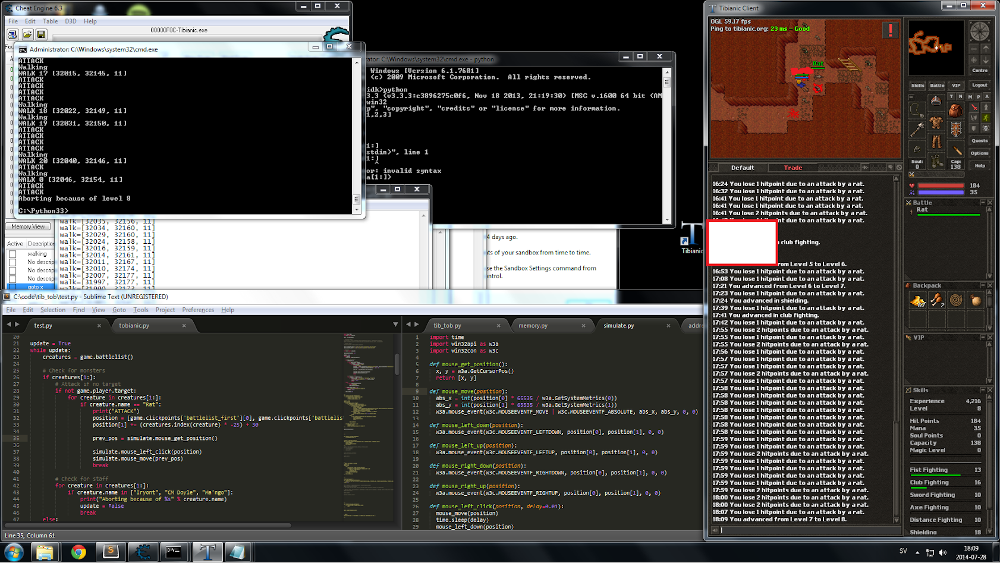

# Tobianic

> [!CAUTION]
> Project was abononed in 2014.

 A cavebot (self-playing robot) for [Medivia Online](https://medivia.online) (former Tibianic).
 

Features:
* Waypoints - Walks via waypoints.
* Auto-attack - Attack whitelisted creatures.
* Auto-heal - Heal with runes or spells at specific health.
* Anti-cheat bypass - Not writing directly to memory. All actions are applied to the GUI.
* Pause - Pause on configurable conditions. For example if a gamemaster is nearby.
* Alarm - Play sound on configurable conditions. For example if low on potions.
* Escape - Run away on configurable conditions. For example if low on health.

Techniques:
* Finding memory addresses with a hex editor.
* Fetching data from process' memory (player, enemies, map and such).
* Automation with customizeble logics.
